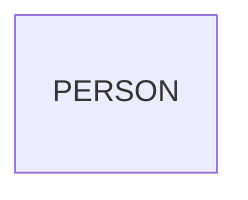

# Entity Model

## Entity Relationship Diagram

### PERSON

Represents an individual tracked within the system.

| Attribute  | Description                             | Data Type | Length/Precision | Validation Rules        |
|------------|-----------------------------------------|-----------|------------------|-------------------------|
| id         | Unique identifier                       | Long      | 19               | Primary Key, Sequence   |
| first_name | Person's first name                     | String    | 100              | Not Null                |
| last_name  | Person's last name                      | String    | 100              | Not Null                |
| email      | Person's email address                  | String    | 255              | Optional, Format: Email |
| phone      | Person's phone number                   | String    | 20               | Optional                |
| birth_date | Person's date of birth                  | Date      | -                | Optional                |
| created_at | Timestamp when record was created       | DateTime  | -                | Not Null                |
| updated_at | Timestamp when record was last modified | DateTime  | -                | Not Null                |
